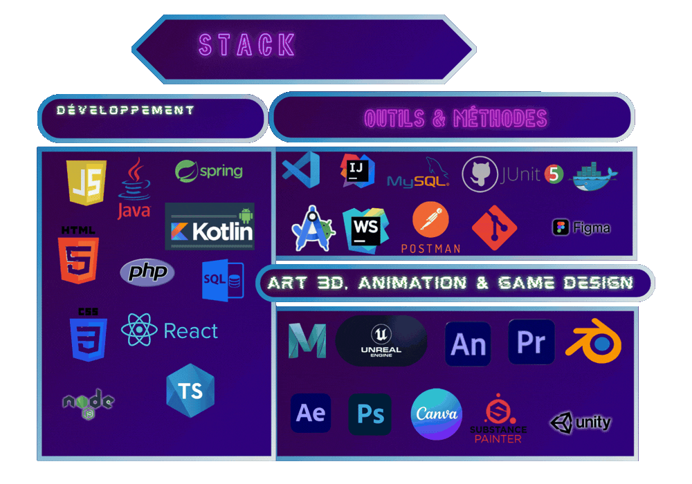
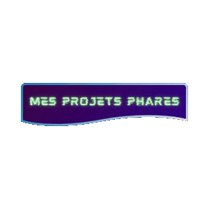
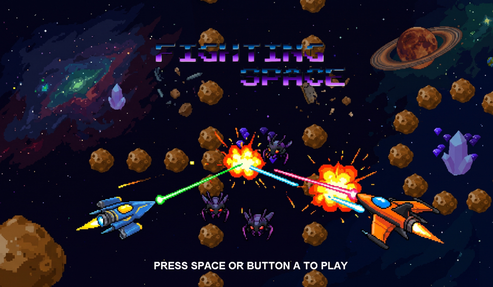

  

  

---

  

---

  

---
---

  

| 🌌 Fighting-Space (Moteur 2D & IA) | Aperçu |
| :--- | :---: |
| Un moteur de combat spatial multijoueur local (PvPvE) en **Java pur (Swing/AWT)**.  • 🏗️ **Architecture :** MVC, Singleton, Flyweight. • 🧠 **Algorithmes :** IA de poursuite (Trigonométrie). • 🎮 **Hardware :** Jamepad (C++/SDL2) pour manettes. • 🧪 **Tests :** Couverture logique via *JUnit 5*.   |  |

---

### 🃏 PokeTCG-Project (Gestionnaire de Collection)
*(En cours de nettoyage...)* L'application web de gestion de cartes à jouer interactives.
