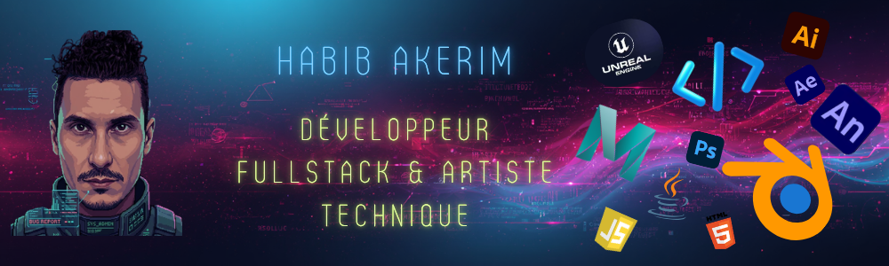
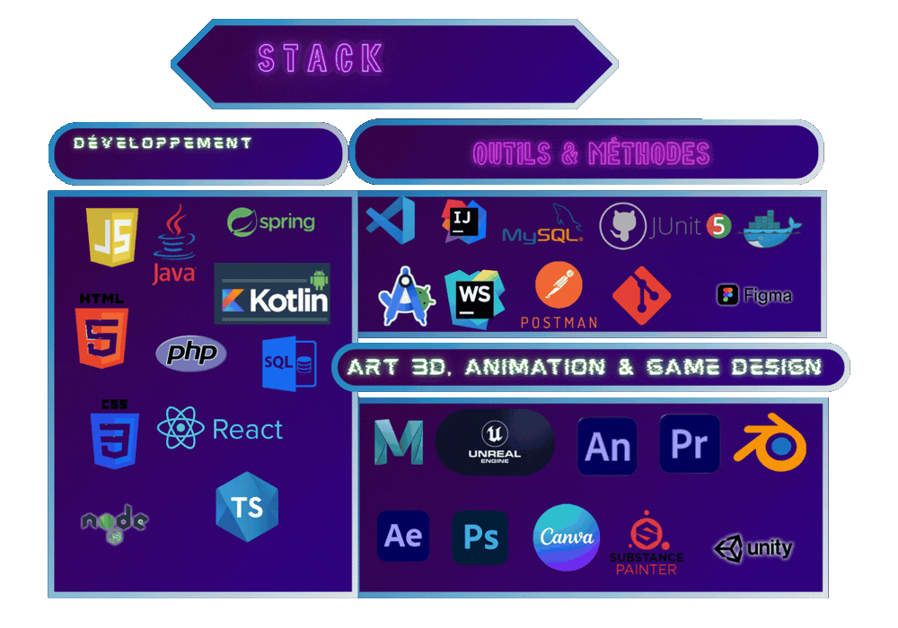
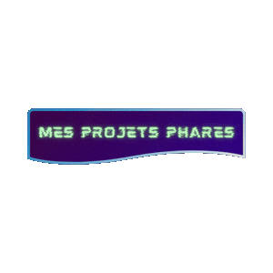
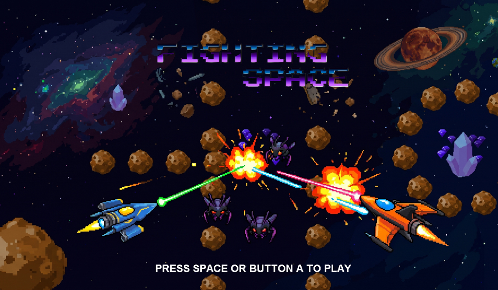
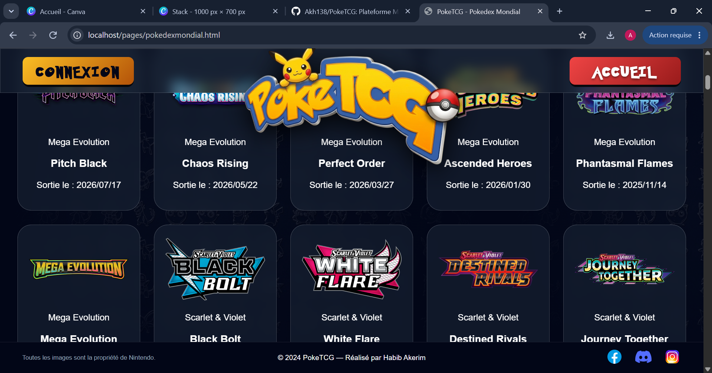
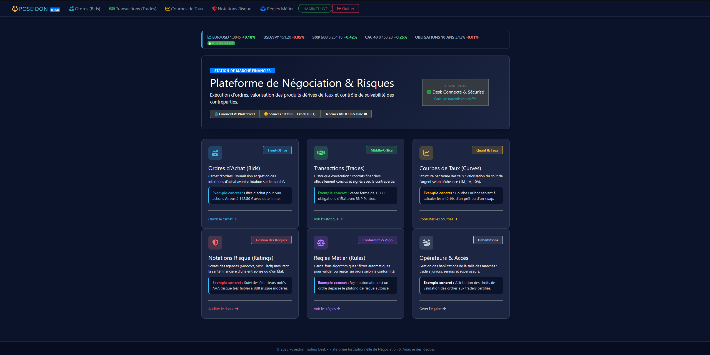
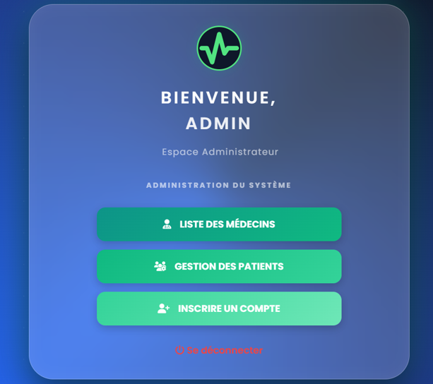
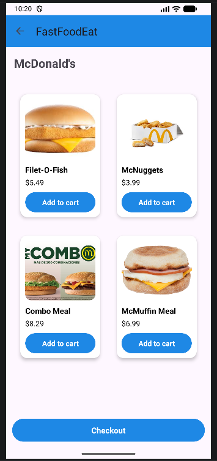

  

  

---

### 👤 À propos de moi

> 🚀 **Développeur Junior** passionné par le développement d'applications logicielles et l'univers du jeu vidéo. Fraîchement diplômé en **Développement Web et Web Mobile (DWWM)**, j'apporte une double compétence unique grâce à mon parcours en **Animation 3D / 2D**.
>
> 🧠 Cette combinaison me permet d'appréhender le développement sous l'angle de la logique pure (**POO, Architecture Logicielle**), mais aussi avec une sensibilité forte pour le rendu visuel et l'expérience utilisateur (**UI/UX, Pipeline Artistique**).
>
> 🎯 **Objectif actuel :** En recherche active d'une **alternance** pour mettre ma polyvalence au service d'une équipe technique ambitieuse.

---

  

---
---

   

---

### 🌌 Fighting-Space (Moteur de Jeu 2D & IA)
<table>
  <tr>
    <td width="50%">
      Un moteur de combat spatial multijoueur local (PvPvE) développé de zéro en <b>Java pur (Swing/AWT)</b>.
      <ul>
        <li>🏗️ <b>Architecture :</b> MVC, Singleton, Flyweight.</li>
        <li>🧠 <b>Algorithmes :</b> IA de poursuite (Trigonométrie).</li>
        <li>🎮 <b>Hardware :</b> Intégration Jamepad (C++/SDL2) pour manettes.</li>
        <li>🧪 <b>Tests :</b> Couverture logique via <i>JUnit 5</i>.</li>
      </ul>
      
    </td>
    <td width="50%">
      
    </td>
  </tr>
</table>

### 🃏 PokeTCG-Project (Marketplace & Pokedex)
Plateforme de trading de cartes Pokémon distribuée en **Microservices** (Java, Spring Cloud, Docker).

<table>
  <tr>
    <td width="50%">
      <b>Points techniques clés :</b>
      <ul>
        <li>🏗️ <b>Architecture :</b> Microservices indépendants avec passerelle API.</li>
        <li>💾 <b>Données :</b> Persistance polyglotte (MySQL pour le financier, MongoDB pour le catalogue).</li>
        <li>🛡️ <b>Sécurité :</b> Authentification JWT, Spring Security, BCrypt.</li>
        <li>🐳 <b>Déploiement :</b> Conteneurisation Docker & Docker Compose.</li>
      </ul>
      
    </td>
    <td width="50%">
      
    </td>
  </tr>
</table>

### 🔱 Poseidon (Trading Desk & Risk Management)
Plateforme financière distribuée de négociation d'ordres et gestion des risques en **Microservices** (Java 17, Spring Boot 3, Spring Cloud, Docker).

<table>
  <tr>
    <td width="50%">
      <b>Points techniques clés :</b>
      <ul>
        <li>🏗️ <b>Architecture :</b> Écosystème de 11 conteneurs orchestrés avec API Gateway et Service Discovery (HashiCorp Consul).</li>
        <li>⚙️ <b>Configuration :</b> Serveur centralisé (Spring Cloud Config) relié à un dépôt GitHub dédié.</li>
        <li>🛡️ <b>Sécurité & RBAC :</b> Authentification Spring Security, chiffrement BCrypt et contrôle d'accès Trader vs Superviseur (Erreur 403).</li>
        <li>⚡ <b>Résilience :</b> Pattern Circuit Breaker (Resilience4j) avec fallback pour garantir la haute disponibilité.</li>
        <li>💾 <b>Données :</b> Persistance polyglotte (MySQL 8.0 pour les comptes, H2 in-memory pour la vélocité des cotations).</li>
      </ul>
      
    </td>
    <td width="50%">
      
    </td>
  </tr>
</table>

### 🏥 Healthcare (Gestion Médicale & Dossier Clinique)
Solution clinique complète distribuée en **Microservices** avec interface haute définition en **Glassmorphism** (Java 17, Spring Boot 3, MongoDB, MySQL, Docker).

<table>
  <tr>
    <td width="50%">
      <b>Points techniques clés :</b>
      <ul>
        <li>🏗️ <b>Architecture :</b> Écosystème de 8 conteneurs avec Service Discovery (HashiCorp Consul) et Config Server centralisé.</li>
        <li>💾 <b>Persistance Hybride :</b> Stockage polyglotte (MySQL 8.0 pour les patients/comptes, MongoDB pour les notes cliniques NoSQL).</li>
        <li>💎 <b>Design System :</b> Interface sur-mesure en Glassmorphism (CSS3 modulaire, filtres en temps réel Vanilla JS, responsive).</li>
        <li>🛡️ <b>Sécurité & Rôles :</b> Authentification Spring Security 6, chiffrement BCrypt et séparation des espaces Praticien / Admin.</li>
        <li>🧪 <b>Qualité & Résilience :</b> Communication déclarative OpenFeign avec mécanismes de secours (Fallbacks).</li>
      </ul>
      
    </td>
    <td width="50%">
      
    </td>
  </tr>
</table>

### 🍔 FastFoodEat (Application Mobile Android)
Application mobile native de commande et livraison de repas (Java 11, Android SDK 35, Glide, Gson, Parcelable).

<table>
  <tr>
    <td width="50%">
      <b>Points techniques clés :</b>
      <ul>
        <li>📱 <b>Mobile Natif :</b> Architecture Android SDK (Java 11, Target SDK 35) avec rendu adaptatif sous <i>RecyclerView</i> et <i>CardView</i>.</li>
        <li>⚡ <b>Performance Mémoire :</b> Sérialisation binaire optimisée via <i>Parcelable</i> pour le transfert d'objets entre Activités.</li>
        <li>🖼️ <b>Pipeline Médias :</b> Chargement asynchrone des visuels distants et mise en cache mémoire/disque avec <i>Glide 4</i>.</li>
        <li>📦 <b>Ingestion de Données :</b> Désérialisation et parsing fluide du catalogue JSON avec <i>Google Gson</i>.</li>
        <li>🛒 <b>Tunnel de Commande Réactif :</b> Découplage par Callback Listeners, bascule Delivery/Pickup et dialogue de succès animé.</li>
      </ul>
      
    </td>
    <td width="50%">
      
    </td>
  </tr>
</table>
